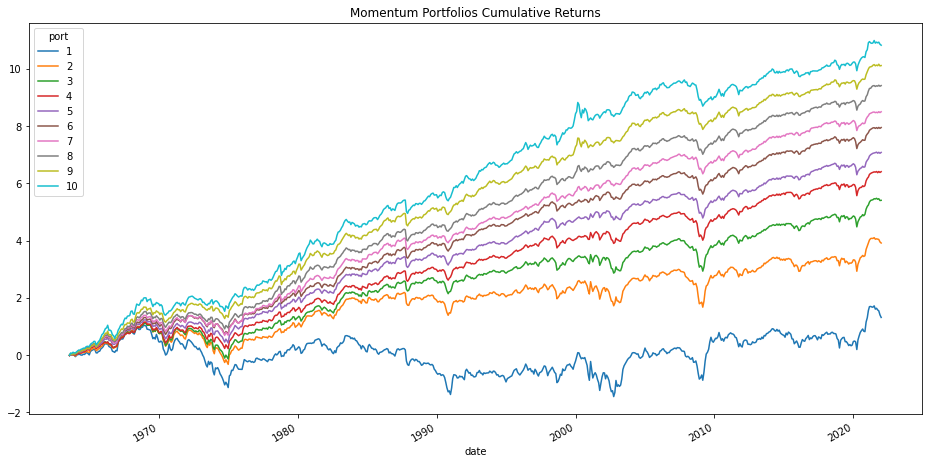
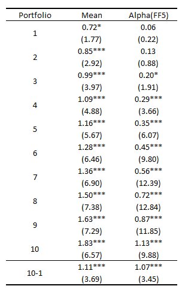

# QuantFin
A toolkit for asset pricing.
Working... ...

### Install

```consol
pip install -i https://test.pypi.org/simple/ QuantFin==0.0.1
```

### Get started

#### Momentum Effects

1) Calculat momentum value on stocks (MOM)
2) Sort stocks on MOM into 10 decile portfolio
3) Report 

```Python

import numpy as np
import pandas as pd
from QuantFin import univariate_sorting, cal_portfolio_rets

# Read CRSP monthly dataset (Source: WRDS)
crsp = ''
crsp.columns = crsp.columns.str.lower()

"""
Screen the sample

1) The sample includes only stocks that are ordinary common share. E.g., shrcd == 10 or 11.
2) The sample includes only stocks listed on NYSE, AMEX or NASDAQ. E.g., exchcd is 1,2,3,31,32 or 33.
3) The sample includes only stocks with valid share price. E.g., prc > 0.
"""

crsp.query("shrcd==10 or shrcd==11", inplcae=True)
crsp.query("exchcd==1 or exchcd==31 or exchcd==2 or exchcd==32 or exchcd==3 or exchcd==33", inplcae=True)
crsp.query('prc > 0', inplcae=True)
crsp.drop_duplicates(['date', 'permno'], inplcae=True)
crsp.set_index(['date', 'permno'], inplcae=True)
crsp = crsp['ret']

"""
# measure mom effects in an efficient way but ignore the requirement of minimum observations
mom = rollingGeometricReturn(mom, 11)
mom = 100*mom
"""

# measure mom effects
mom = mom + 1
mom = mom.rolling(window=11, min_periods=9).apply(pd.DataFrame.prod)
mom = 100*(mom-1)

# skip the most recent month, mom[-11, -1]
mom = mom.shift(1) 
mom = mom.unstack().rename('mom').reset_index()
mom = mom.merge(crsp, on=['permno', 'date'], how='left')

# sort stocks based on last period's mom, mom(t-1)
mom = mom.sort_values(['permno', 'date'])
mom.loc[:, 'mom(t-1)'] = mom.groupby(['permno'])['mom'].shift(1)
mom = univariate_sorting(mom, on='mom(t-1)', time_label='date', port_label='port', method='smart')

# calculate returns on the formed portfolis
sample = mom.query("'1963-06-30' <= date <= '2021-12-31'")
samp_ret = cal_portfolio_rets(panel_data=sample, ret_label='ret', time_label='date', port_label='port')
#samp_ret = cal_portfolio_rets(panel_data=sample, ret_label='ret', time_label='date', port_label='port', weight_on='marketCap') # calcualte value-weighted returns for portfolios
np.log(samp_ret+1).cumsum().plot(figsize=(16,8), title='Momentum Portfolios Cumulative Returns')
```


Print summary performance of portfolios, including mean returns and alphas(FF5):
```python
from QuantFin import Performance
samp_ret['10-1'] = samp_ret.loc[:, 10] - samp_ret.loc[:, 1]
print(Performance(samp_ret, models=['FF5']).summary())
```



Run PanelOLS/Fama-MacBeth regressions and collect results:

```python
from QuantFin.PanelRegs import multiregressions

formulas = {
    "Customised FixedEffects": "rets ~ 1 + mom', fe(permno year)",
    "Filter data": "rets ~ 1 + mom if date >= '2000-01-01', fe(permno year)",
    "Cluster Standard Errors": "rets ~ 1 + mom if date >= '2000-01-01', fe(permno year), cluster(permno)",
    "FamaMacbeth": "rets ~ 1 + mom if date >= '2000-01-01', famamacbeth, robust",
    "logFunct": "mom ~ 1 + log(marketCap) + bm + illiq + turnover, fe(permno date), cluster(permno)",
    "Interaction": "mom ~ 1 + log(marketCap)##bm + illiq +turnover, fe(permno date), cluster(date)" 
}

multiregressions(formulas, data=sample)
```